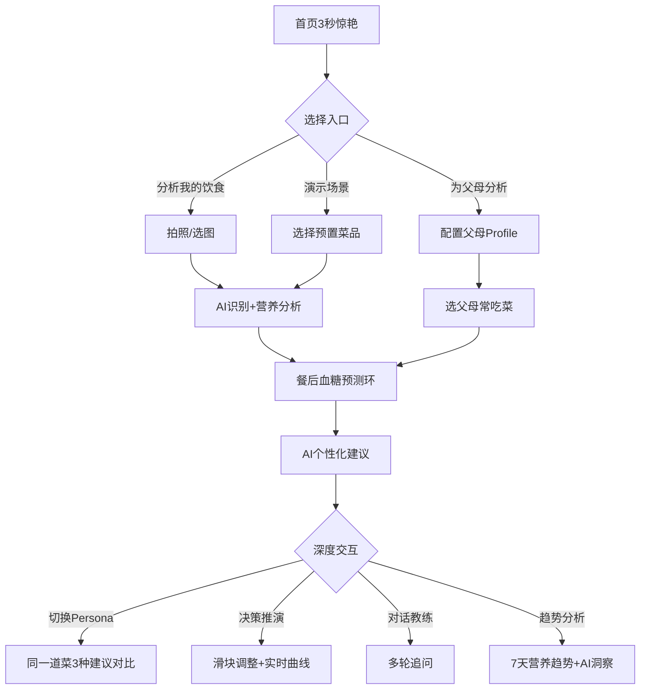

# 知食 · 慢病饮食AI伙伴 — 产品需求文档（PRD）

> 文档版本：v1.0 | 创建日期：2026-07-13
> 适用：TRAE AI 创造力大赛 · 社会服务赛道

---

## 1. 产品概述

**知食** 是一款面向慢病人群（1.4亿糖尿病患者 + 3.3亿高血压患者）的 AI 饮食健康预测应用。区别于市面上所有"记录你吃了什么"的工具型 App，知食开创性地做"**预测这顿饭对你的身体意味着什么**"。

- **核心价值**：拍一张饭菜照片，AI 实时预测餐后血糖/血压影响，并给出个性化调整建议
- **目标用户**：慢病患者及其家属（尤其是为父母健康担心的子女）
- **市场价值**：填补"饮食健康预测"市场空白，做第一个把"营养数据"翻译为"个人健康后果"的产品
- **品牌主张**：知食 · 让每一口都被懂

---

## 2. 核心功能

### 2.1 用户角色

| 角色 | 进入方式 | 核心权限 |
|------|---------|---------|
| 慢病患者本人 | 首屏入口"分析我的饮食" | 配置个人慢病Profile，拍照分析，决策推演 |
| 慢病患者家属 | 首屏入口"为父母分析" | 配置父母Profile，替父母分析饮食健康影响 |
| 演示访客（评委） | 首屏入口"演示场景" | 一键体验预置菜品+慢病场景，3秒惊艳 |

### 2.2 功能模块

1. **首页（3秒惊艳）**：品牌主张 + 3个核心入口卡片 + 1张实时演示菜品卡
2. **拍照分析页**：拍照/选图 → AI识别 → 餐后血糖预测环 → 个性化建议
3. **慢病Persona切换器**：同一道菜，3种慢病身份3种AI建议对比
4. **饮食决策推演**：滑块调整分量/搭配，实时看血糖曲线变化
5. **为父母分析**：输入父母慢病情况，分析父母常吃菜的健康影响
6. **AI对话教练**：自然语言追问"我吃了碗牛肉面会怎样"
7. **趋势分析**：本周营养趋势图 + AI洞察

### 2.3 页面详情

| 页面名称 | 模块名称 | 功能描述 |
|---------|---------|---------|
| 首页 | 品牌Hero区 | "知食 · 让每一口都被懂"大字+呼吸动画 |
| 首页 | 3入口卡片 | [分析我的饮食] / [为父母分析] / [演示场景] |
| 首页 | 实时演示菜品卡 | 展示1道预置菜品的AI预测结果，吸引评委点击 |
| 首页 | 慢病Persona徽章 | 显示当前选中的慢病身份（默认演示模式） |
| 拍照分析页 | 拍照/选图入口 | 调用相机或选择预置菜品图 |
| 拍照分析页 | 食物识别结果 | 显示AI识别的食物种类和分量 |
| 拍照分析页 | 营养成分卡 | 热量/碳水/脂肪/蛋白质/钠5项数据 |
| 拍照分析页 | **餐后血糖预测环** | 圆环动效显示预测血糖值+三色信号灯+对比曲线 |
| 拍照分析页 | 个性化建议气泡 | AI对话式建议："预计餐后血糖升至11.2，建议..." |
| Persona切换器 | 身份切换Tab | [糖尿病] [高血压] [糖尿病+高血压] [健康人] |
| Persona切换器 | 同菜异建议对比区 | 切换身份时，预测环和建议实时变化 |
| 决策推演页 | 调整滑块组 | [主食分量] [搭配蔬菜] [餐后运动] |
| 决策推演页 | 实时血糖曲线 | 滑块变化时曲线即时更新 |
| 决策推演页 | 推演结论卡 | "减少1/3米饭→血糖峰值↓2.7" |
| 为父母分析 | 父母Profile配置 | 姓名/年龄/慢病类型/指标 |
| 为父母分析 | 父母常吃菜分析 | 选菜→AI输出"对您父亲(2型糖尿病)..." |
| 为父母分析 | 关怀建议卡 | "建议父亲减少面汤摄入，因钠含量..." |
| AI对话教练 | 对话窗口 | 多轮对话，AI基于慢病Profile回答 |
| 趋势分析 | 7天营养趋势图 | 碳水/钠/热量折线图 |
| 趋势分析 | AI洞察气泡 | "本周碳水偏高，血糖波动大，建议..." |

---

## 3. 核心流程

### 3.1 评委3秒惊艳路径
评委打开Demo → 首屏看到品牌主张+1张已分析完成的菜品卡（带预测环动效）→ 点击"演示场景" → 选一道菜 → 预测环炸出 → AI对话建议 → 切换慢病Persona看对比 → 完成3秒惊艳+1分钟理解。

### 3.2 主流程：拍照分析
用户点击"分析我的饮食" → 拍照/选图 → AI识别食物+分量 → 营养成分分析 → **预测环显示餐后血糖** → AI个性化建议 → 可选：进入决策推演/对话教练。

### 3.3 情感流程：为父母分析
用户点击"为父母分析" → 配置父母Profile → 选父母常吃的菜 → AI输出"对您父亲..."的健康影响 → 给出关怀建议 → 触发家庭情感共鸣。

### 3.4 流程图

---

## 4. 用户界面设计

### 4.1 设计风格

**美学方向：温暖科技感 / Editorial Health**

打破健康类App"白底蓝色"的刻板印象，采用**温暖琥珀色 + 深墨绿**为主色调，营造"专业可信+温暖关怀"的双重感受。借鉴编辑杂志的版式美学，让数据可视化既精准又有阅读愉悦感。

- **主色调**：`#D4A574`（琥珀金 · 温暖）+ `#1F3A2E`（深墨绿 · 专业）
- **辅助色**：`#E8DCC4`（米杏 · 背景）+ `#C8553D`（警示红 · 健康风险）
- **信号色**：`#5C8A5C`（绿·安全）/ `#E6B655`（黄·临界）/ `#C8553D`（红·超标）
- **字体方案**：
  - 显示字体：`'Noto Serif SC', serif`（思源宋体 — 杂志感+东方韵味）
  - UI字体：`'Noto Sans SC', sans-serif`（思源黑体 — 现代清爽）
  - 数字字体：`'JetBrains Mono', monospace`（数据精准感）
- **按钮风格**：圆角矩形（8px圆角），主按钮深墨绿底白字，次按钮描边样式
- **布局风格**：杂志式不对称网格 + 卡片化信息块 + 大量留白
- **图标/Emoji**：使用内联SVG图标（线性风格，1.5px描边），数据可视化用渐变填充

### 4.2 页面设计概览

| 页面名称 | 模块名称 | UI元素 |
|---------|---------|--------|
| 首页 | 品牌Hero区 | 大字"知食"+ 副标题 + 呼吸圆点动画 |
| 首页 | 3入口卡片 | 不对称卡片网格，主推卡片高亮 |
| 首页 | 实时演示菜品卡 | 预测环mini版+菜品图+1句话预测 |
| 拍照分析页 | 预测环主体 | 中央大圆环（200px）+ 数字+三色信号灯 |
| 拍照分析页 | 营养成分雷达图 | Chart.js雷达图，5维营养数据 |
| Persona切换器 | 身份Tab栏 | 横向滑动Tab + 切换时建议区淡入淡出 |
| 决策推演页 | 滑块组 | 自定义样式滑块，实时数值显示 |
| 决策推演页 | 血糖曲线对比 | Chart.js折线图，两条曲线叠加 |
| 为父母分析 | 父母Profile卡 | 头像+慢病徽章+核心指标 |
| 对话教练 | 聊天气泡 | 用户右/AI左，AI气泡带预测环mini |

### 4.3 响应式设计

- **Desktop-first**：优先桌面体验，评委多数用电脑演示
- **移动端适配**：单列布局，预测环缩小至160px，滑块改为垂直滑动
- **触控优化**：滑块、Tab等交互元素最小44px触控区
- **断点**：768px / 1024px

### 4.4 3D/动效指导

不使用3D，重点动效：
- **预测环炸出动画**：拍照后2秒延迟 → 1秒内圆环从0填充到目标值，数字滚动
- **数字滚动效果**：预测值从0递增到11.2，每步0.1
- **三色信号灯渐变**：圆环填充时颜色从绿→黄→红渐变
- **卡片悬浮效果**：3D倾斜+阴影变化
- **页面切换**：淡入淡出 + 微滑动
