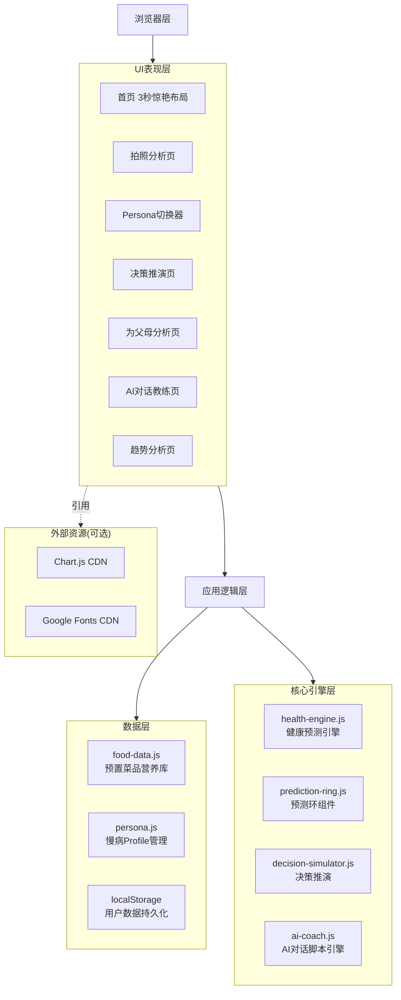
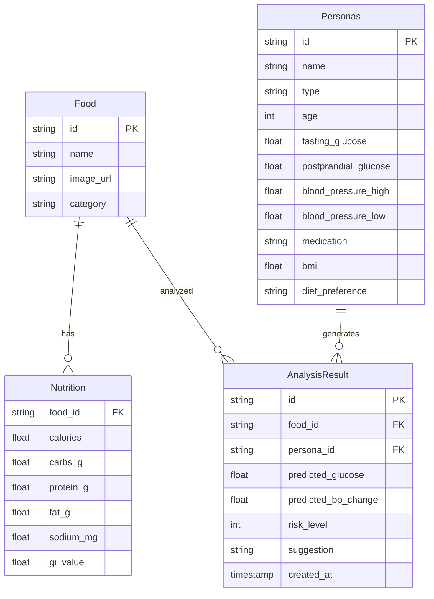

# 知食 · 技术架构文档

> 文档版本：v1.0 | 创建日期：2026-07-13
> 适用：TRAE AI 创造力大赛 · 社会服务赛道

---

## 1. 架构设计

**纯前端单页应用**（HTML5 + 原生JS），无后端服务依赖，符合大赛"HTML文件上传"要求。



## 2. 技术描述

### 2.1 技术栈

| 层 | 技术 | 版本/来源 | 理由 |
|----|------|----------|------|
| 框架 | **React 18 + TypeScript** | react@18.3.1 | 组件化开发效率高，类型安全 |
| 构建工具 | **Vite 5** | vite@5.4.21 | 极速 HMR，构建产物为静态文件可部署 |
| 样式 | **Tailwind CSS 3** | tailwindcss@3.4.10 | 原子化CSS，设计系统统一管理 |
| 路由 | **React Router DOM 6** | react-router-dom@6.26.0 | SPA 路由，hash 路由兼容静态部署 |
| 状态管理 | **Zustand 4** | zustand@4.5.4 | 轻量、API 简洁、支持 persist 中间件 |
| 图表 | **Chart.js + react-chartjs-2** | 4.4.3 / 5.2.0 | 雷达图、折线图友好 |
| 图标 | **lucide-react** | 0.439.0 | 现代线性图标库 |
| 字体 | Google Fonts | CDN | Noto Serif SC + Noto Sans SC + JetBrains Mono |
| 数据存储 | localStorage | 浏览器原生 | Zustand persist 中间件封装 |
| AI对话 | 预置对话脚本引擎 | 自研 | 不依赖外部API，保证评委体验100%流畅 |

> **构建产物说明**：Vite 构建后产出 dist/ 目录，包含 index.html + assets/，可部署到任何静态托管（Vercel/Netlify/GitHub Pages）或打包为单 HTML 文件上传，符合大赛"提供可体验地址或HTML格式文件"要求。

### 2.2 项目结构（实际）

```
e:\.traesolo\ai-health\
├── index.html                  # 主入口（HTML5）
├── package.json                # 依赖与脚本
├── vite.config.ts              # Vite 配置
├── tsconfig.json               # TypeScript 配置
├── tailwind.config.js          # Tailwind 配置 + 设计系统
├── postcss.config.js           # PostCSS 配置
├── src/
│   ├── main.tsx                # 应用入口（BrowserRouter 包裹）
│   ├── App.tsx                 # 路由配置
│   ├── index.css               # 全局样式 + Tailwind 指令 + 设计系统
│   ├── store/
│   │   └── useStore.ts         # Zustand 状态管理（含类型定义）
│   ├── data/
│   │   └── foods.ts            # 预置菜品库(12道) + 慢病Persona库(4种)
│   ├── lib/
│   │   └── healthEngine.ts    # 健康预测引擎（核心算法）
│   ├── components/
│   │   ├── Layout.tsx          # 全局布局 + 顶部导航 + 页脚
│   │   ├── Logo.tsx            # 品牌Logo (碗+环+热气)
│   │   ├── PredictionRing.tsx  # 亮点1：餐后血糖预测环
│   │   └── PersonaBadge.tsx   # 慢病身份徽章
│   └── pages/
│       ├── Home.tsx            # 首页（3秒惊艳）
│       ├── Analyze.tsx         # 拍照分析页
│       ├── Persona.tsx         # 亮点2：慢病Persona切换器
│       ├── Simulate.tsx        # 亮点3：饮食决策推演
│       ├── Parent.tsx          # 亮点4：为父母分析
│       ├── Coach.tsx           # AI对话教练
│       └── Trends.tsx          # 趋势分析
└── 慢病饮食AI伙伴-项目上下文.md  # 项目上下文文档
```

### 2.3 核心算法：健康预测引擎

```
预测餐后血糖增量 = (碳水g × GI值 × Profile血糖敏感度) / 10

其中：
- GI值：食物血糖生成指数（预置数据库）
- 血糖敏感度系数：基于慢病类型动态计算（糖尿病1.4，健康人0.7）

预测餐后血压增量 = (钠摄入mg / 1000) × 钠敏感度系数 × 2.2

决策推演模拟：
- 减少碳水 → carbs × (1 - reduction)
- 搭配蔬菜 → GI值 × 0.7（最低40）
- 餐后运动 → 每20分钟降低1.2 mmol/L
```

## 3. 路由定义

单页应用，前端路由（hash路由）：

| 路由 | 用途 |
|------|------|
| `#/` 或 `#/home` | 首页（3秒惊艳） |
| `#/analyze` | 拍照分析页（含预测环） |
| `#/persona` | 慢病Persona切换器 |
| `#/simulate` | 饮食决策推演页 |
| `#/parent` | 为父母分析页 |
| `#/coach` | AI对话教练页 |
| `#/trends` | 趋势分析页 |

## 4. API定义

无后端 API。所有数据为前端预置或 localStorage 存储。

## 5. 服务端架构

无服务端。纯前端单页应用，可直接以 HTML 文件形式上传参赛。

## 6. 数据模型

### 6.1 数据模型定义



### 6.2 数据定义语言

Demo阶段不使用数据库，所有数据以 JS 对象形式预置：

```javascript
// 食物营养库示例
const FOODS = [
  {
    id: 'beef_noodle',
    name: '牛肉面',
    image: '/assets/images/beef-noodle.jpg',
    nutrition: {
      calories: 580, carbs_g: 75, protein_g: 22,
      fat_g: 18, sodium_mg: 1850, gi_value: 78
    }
  },
  // ...更多菜品
];

// 慢病Persona示例
const PERSONAS = [
  {
    id: 'diabetes_t2',
    name: '2型糖尿病',
    age: 58,
    fasting_glucose: 7.2,
    postprandial_glucose: 9.8,
    medication: '二甲双胍 500mg bid',
    bmi: 26.0,
    diet_preference: '北方口味偏咸'
  },
  // ...更多Persona
];
```

---

## 7. 开发里程碑（Session 规划）

| Session | 任务 | 亮点覆盖 |
|---------|------|---------|
| S1 | 项目骨架 + 品牌视觉系统 + 首页3秒惊艳布局 | 品牌定调 |
| S2 | 亮点1：餐后血糖预测环组件 | 亮点1 ✓ |
| S3 | 亮点2：慢病Persona切换器 | 亮点2 ✓ |
| S4 | 亮点4：为父母分析模式 | 亮点4 ✓ |
| S5 | 亮点3：饮食决策推演 + AI对话教练 | 亮点3 ✓ |
| S6 | 趋势分析 + 整体打磨 + 移动端适配 | 完整度 |

---

## 8. 关键技术决策

1. **食物识别**：Demo阶段使用预置图片+模拟识别结果，不调用真实AI视觉API，保证评委体验100%流畅
2. **LLM对话**：使用预置对话脚本引擎（基于慢病场景的预设问答树），不依赖外部LLM API
3. **数据存储**：localStorage 即可，不需要后端数据库
4. **图表库**：Chart.js（CDN引入），轻量易用
5. **字体方案**：思源宋体（杂志感）+ 思源黑体（现代感）+ JetBrains Mono（数据感）
